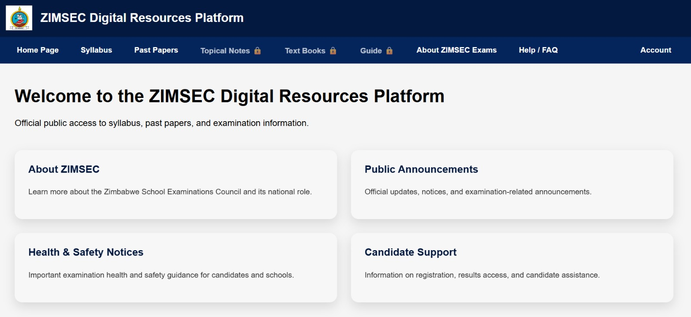
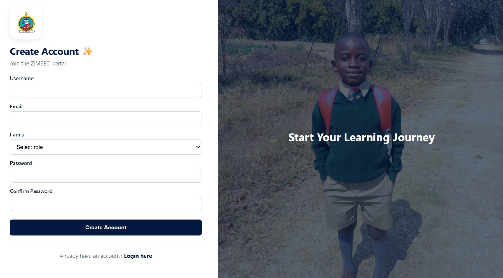
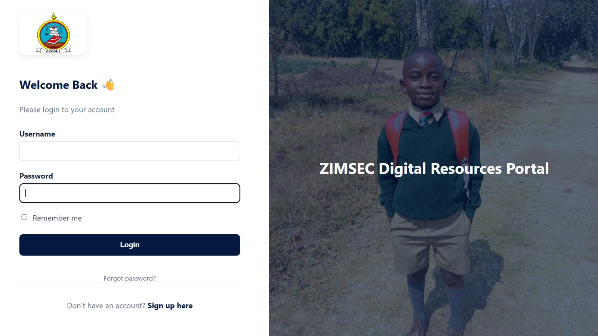
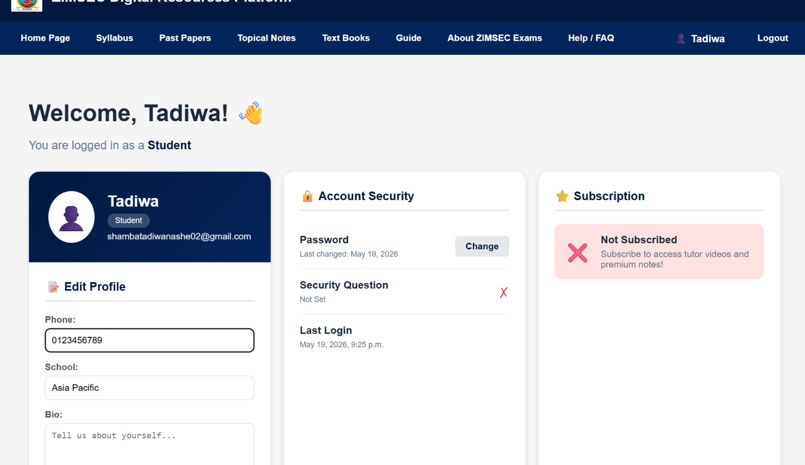
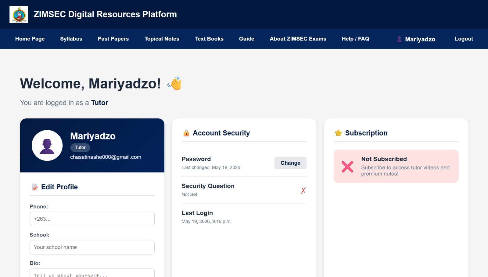
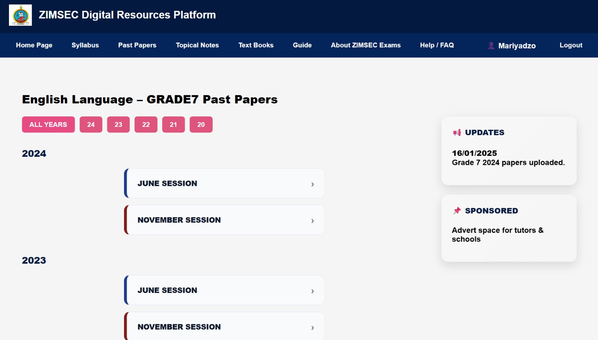
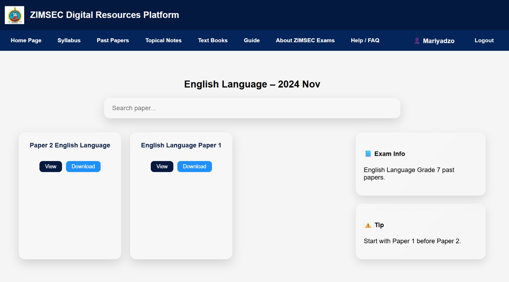
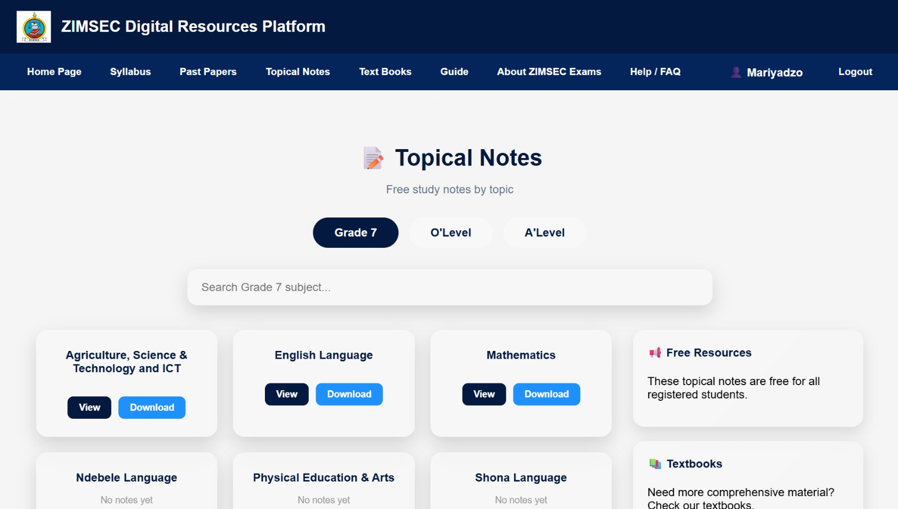

# 📚 ZIM Exam Portal

A Zimbabwe digital resource platform that gives every student — regardless of background — equal access to quality educational materials for Grade 7, O'Level, and A'Level examinations.

---

## 🌍 About The Project

The ZIM Exam Portal was built to bridge the educational resource gap in Zimbabwe, where many students lack access to past papers, textbooks, and study guides. This platform provides a centralised, affordable, and accessible solution for Zimbabwean students and tutors.

---

## ✨ Features

- 📄 **Past Papers** — Browse by level, subject, year, and session
- 📖 **Topical Notes** — Free for all registered users
- 📚 **Textbooks** — Purchase and download digital textbooks via Paynow
- 🗺️ **Study Guides** — Subject-specific guides uploaded by tutors
- 📋 **Syllabus** — Full ZIMSEC syllabus for all levels
- 👤 **Role-Based Access** — Separate student and tutor dashboards
- 🔐 **Secure Authentication** — Login, signup, and password reset
- 💳 **Payment Integration** — Paynow and PayPal support

---

## 📸 Screenshots

### 🏠 Home Page


### 📝 Sign Up Page


### 🔐 Login Page


### 🎓 Student Dashboard


### 👨‍🏫 Tutor Dashboard


### 📄 Past Papers Section


### 📥 Past Paper Download


### 📝 Topical Notes


---

## 🛠️ Tech Stack

- **Backend** — Python, Django
- **Frontend** — HTML, CSS, JavaScript
- **Database** — SQLite
- **Payment** — Paynow, PayPal
- **Auth** — Django built-in authentication

---

## ⚙️ Setup

```bash
git clone https://github.com/Tadie08/zim-exam-portal.git
cd zim-exam-portal
python -m venv venv
venv\Scripts\activate
pip install -r requirements.txt
python manage.py migrate
python manage.py runserver
```

---

## 👨‍💻 Developer

**Tadiwanashe Shamba** — Computer Engineering Student, APU Malaysia

[](https://www.linkedin.com/in/tadiwanashe-shamba-a1b165274/)
[](https://github.com/Tadie08)
